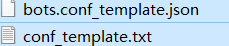
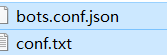

欢迎来到我的第一个 bot 项目

此rep是本人从学习阶段开始编写的 所以结构设计的有些 ~~屎~~

所以这(坨)代码 更像是 ~~屎山~~

但是涵盖的功能 和 代码量 还是很多的

该rep也包含(运用)了 我所学的 大部分 知识(编程)

~~所以还请 大佬勿喷~~

该项目 由于经过几次的框架更改 变成如今的面孔

* [Project](https://github.com/gdpl2112/mirai-bot-first-src/tree/master/main/java/Project)
  为主体内容 <br>
  其入口 将消息转化为 string 依靠 [SpringTool](https://github.com/Kloping/my-spring-tool) 匹配 Action的形式执行<br>
  * [具体入口实现](https://github.com/gdpl2112/mirai-bot-first-src/blob/master/main/java/io/github/kloping/Mirai/Main/Handlers/MyHandler.java)
  * [具体出口实现](https://github.com/gdpl2112/mirai-bot-first-src/blob/master/main/java/io/github/kloping/Mirai/Main/Resource.java)
* mirai 的 [启动目录](https://github.com/gdpl2112/mirai-bot-first-src/blob/master/main/java/io/github/kloping/Mirai/Main/)
  *
  通过 [BotStarter](https://github.com/gdpl2112/mirai-bot-first-src/blob/master/main/java/io/github/kloping/Mirai/Main/BotStarter.java)
  获取配置文件中的 bot id password 登录
  * 以及消息通道注册,处理

- 该rep 以转移至 [gdpl2112](https://github.com/gdpl2112) organizations
- 且仅对其内成员可见
- 同时[欢迎加入QQ群聊](https://jq.qq.com/?_wv=1027&k=30zOUA9B)

## 使用

在您的mydb1数库中执行 文件 [sql](https://gitee.com/kloping/mirai-bot-first/blob/master/sql/init.sql)

[mydb1-主库](https://gitee.com/kloping/mirai-bot-first/blob/master/application.yml#L3)
[mydb1存储消息用](https://gitee.com/kloping/mirai-bot-first/blob/master/spring/conf/application0.yml)
可自行更名

更改配置



将其更名为



- bot.con.json

```json  
  {
    "bots": [
    {
      //QQ密码
      "passWord": "password",
      //QQ账号
      "qq": 123456789
    }
  ]
  }
```

- conf.txt

```text
//非法名词
Illegal.txt=
//非法名词
Illegal.send=
//可留空
handled.url=
//超级权限QQ号 , #逗号分割
superQL=1,2
//机器人自称(名字 
bot.myName=0号
//登录协议
bot.protocol=ANDROID_PHONE
//是否为测试环境
env.test=false
```

Linux 依赖下载

    git clone https://gitee.com/kloping/mirai-bot-first

确保maven已经安装

    mvn -f pom.xml dependency:copy-dependencies -X

