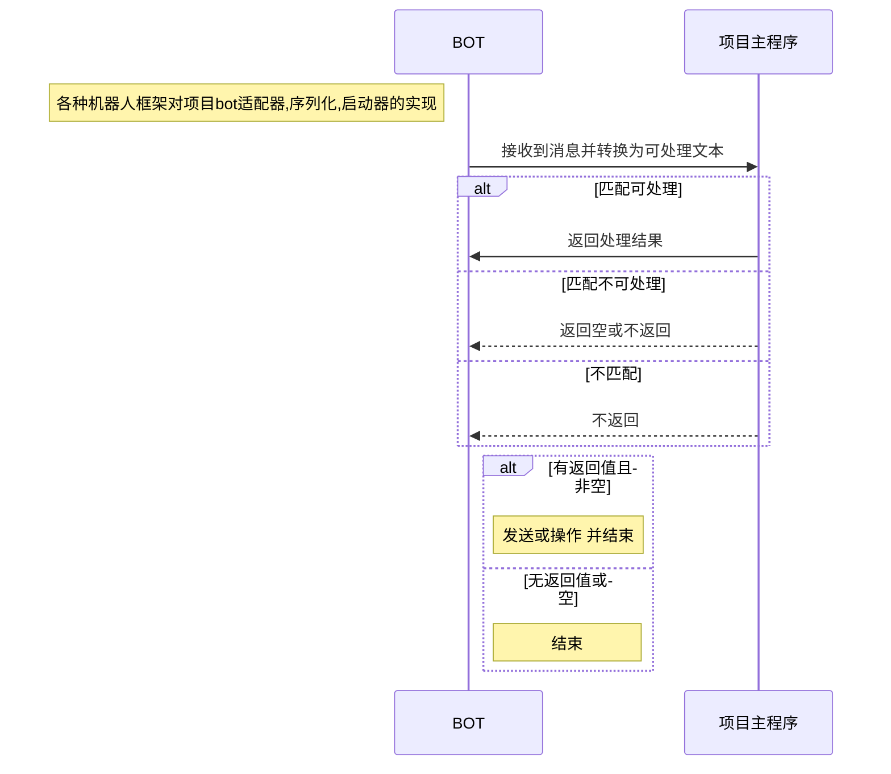

## 新架构

```mermaid

sequenceDiagram
    participant A as BOT
    participant B as 项目主程序
    Note left of A: 各种机器人框架对项目bot适配器,序列化,启动器的实现
    A ->> B: 接收到消息并转换为可处理文本 
    alt 匹配可处理
        B ->> A: 返回处理结果
    else 匹配不可处理
        B -->> A: 返回空或不返回
    else 不匹配
        B -->> A: 不返回
    end
    
    alt 有返回值且非空
        Note right of A: 发送或操作 并结束
    else 无返回值或空
        Note right of A: 结束
    end
```