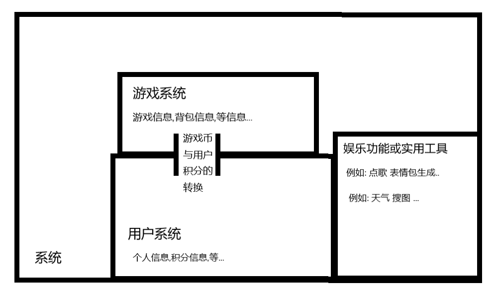

## 项目结构

```

┍───────────────────────────┒
│   message    ←     Mirai  │
│     ↓           send ↑    │
├───────────┒     ┍─────────┤ 
│ SpingTool │→ ↓  │ Convert │
├─────⇕─────┤match├────↑────┤
│SpringBoot │  → →│ Logical │
└───────────┴─────┴─────────┙

```

- mirai qq机器人框架
- message 接收到消息
- [SpringTool](https://github.com/Kloping/my-spring-tool) 自研框架
- [SpringBoot](https://spring.io/projects/spring-boot/) MVC 架构框架 mybatisPlus 整合
- match 匹配业务 关键词
- Logical 逻辑处理 并输出结果
- Convert 接收结果并转换为可发送的对象
- send 通过 qq机器人框架发送

## 项目系统



## 所有命令

<details>
    <summary>基础用户命令</summary>
     <li>积分查询/查询积分</li>
     <li></li>
</details>


<hr>
<br>